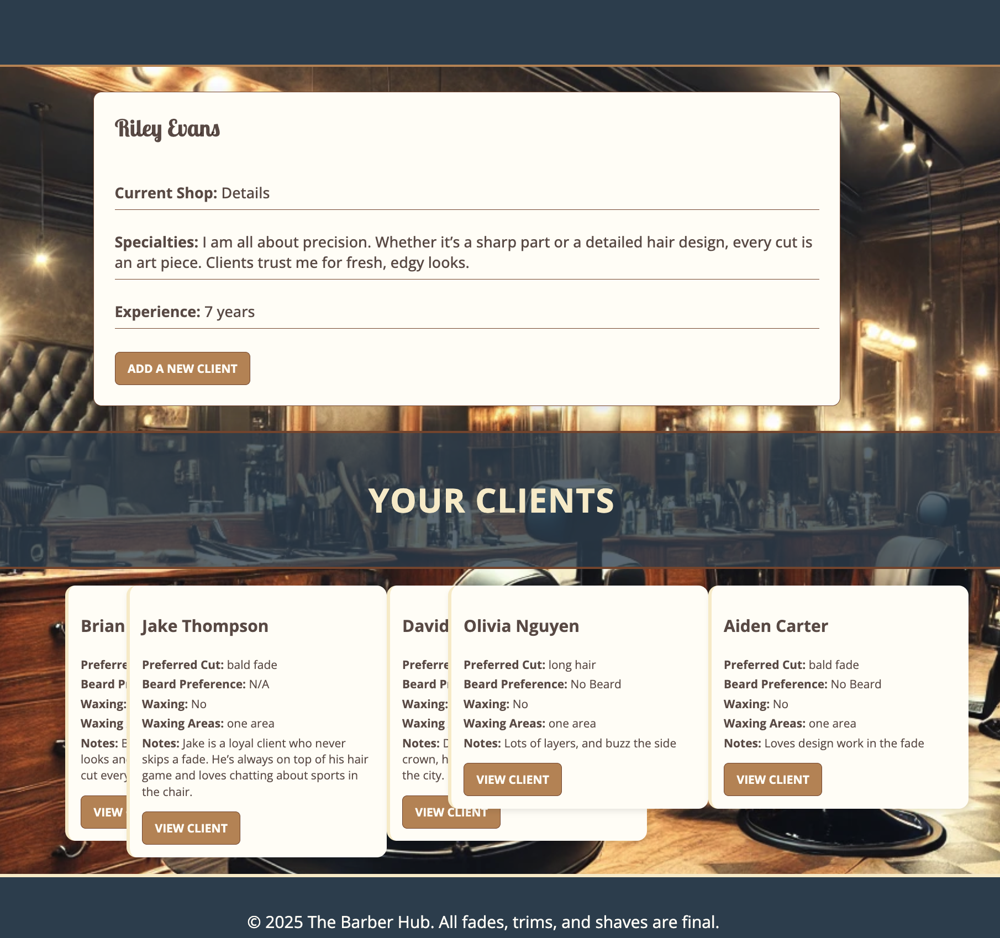
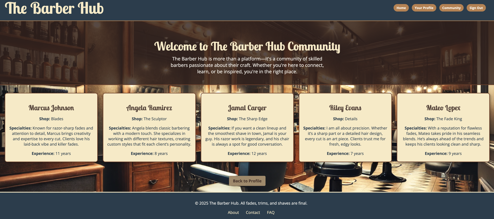

# 💈 The Barber Hub

A full-stack **Node.js/Express/MongoDB** application that allows users to **book barber services** online. Users can register, log in, and manage their clients with **full CRUD functionality**.


## 🚀 Live Demo
🔗 **[View the Deployed App](https://thebarberhub-94f9e608dda6.herokuapp.com/)**

---

## 📌 Features

✅ User authentication (register/login/logout)  
✅ CRUD operations for barbers, clients and services  
✅ Session-based authentication for security  
✅ Only logged-in users can book or manage services  
✅ Responsive design using **CSS Grid & Flexbox**  
✅ Accessible color contrast (**WCAG 2.0 AA**)  

---

## 🛠 Technologies Used

| **Stack**          | **Technologies**                                     |
|--------------------|------------------------------------------------------|
| **Frontend**       | HTML, CSS, JavaScript, EJS (Embedded JavaScript)     |
| **Backend**        | Node.js, Express.js                                  |
| **Database**       | MongoDB, Mongoose                                    |
| **Authentication** | Express-session, bcrypt                              |
| **Deployment**     | Heroku                                               |
|--------------------|------------------------------------------------------|
---

## 📸 Screenshots

### 🔹 Sign-In Page


### 🔹 User Dashboard


### 🔹 Community Page


---

## 🔧 Installation & Setup

### 1️⃣ Clone the repository
```bash
git clone https://github.com/your-github-username/your-repo-name.git
cd your-repo-name

2️⃣ Install dependencies

npm install

3️⃣ Set up environment variables

Create a .env file in the root directory and add the following:

PORT=3000
MONGO_URI=your-mongodb-uri
SESSION_SECRET=your-secret-key

4️⃣ Start the development server

npm run dev

Then visit http://localhost:3000 in your browser.

⸻

🔑 User Stories
	•	🛂 As a new user, I want to sign up and log in so I can access my dashboard.
	•	✂️ As a barber, I want to add my favorite clients so I can remember details about appointments.
	•	✏️ As a logged-in user, I want to edit, update and delete client information.


⸻

💡 Next Steps / Future Enhancements
	•	📸 Allow users to upload client haircut photos to showcase past work
	•	⭐ Create more functionality with barber profiles and add ratings
	•	🎨 Improve UI/UX design
	•   	🌟 Allow barbers to **rate & review** fellow barber haircut photos 

⸻

🙌 Attributions
	•	Fonts from Google Fonts
	•	Deployed on Heroku

⸻

🎉 Thanks for checking out my project! Let me know if you have any feedback. 🚀

